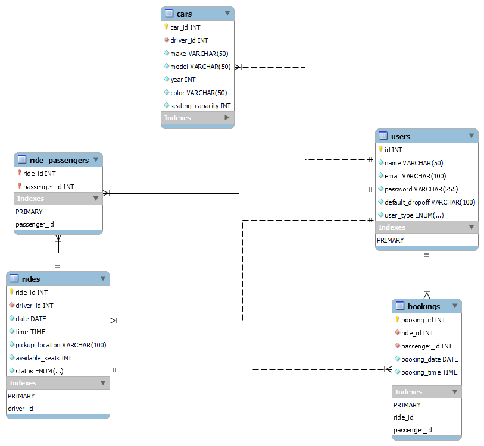
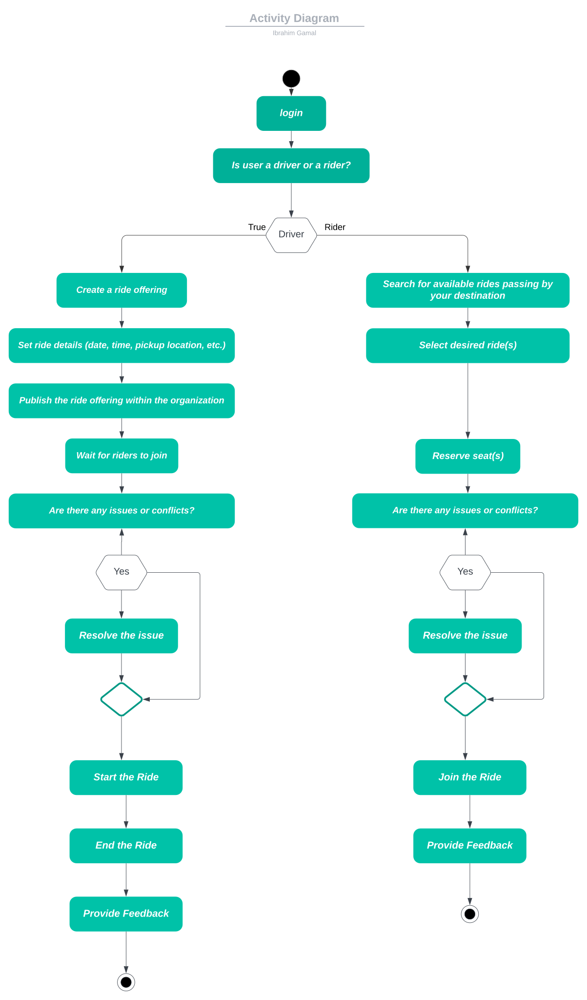

# Carpooling

## ER Diagram

## Activity Diagram

link: [Activity Diagram Lucidchart](https://lucid.app/documents/embedded/612ab06c-b2ce-42f6-a908-c0d885258926#)

<!-- link: [Class Diagram Lucidchart](https://lucid.app/documents/embedded/685b0fd3-012c-4ea6-9e92-f7fae120cae1) -->

## File Structure

The file structure of this project is organized as follows:

- `passenger.html`: HTML file for the passenger interface.
- `driver.html`: HTML file for the driver interface.
- `styles.css`: CSS file for the basic interfcaes.
- `database.sql`: SQL script for creating the database schema.
- `php/`: Directory containing PHP scripts used for server-side processing.
    - `test_connection.php`: Tests the connection to the database.
    - `create_ride.php`: Creates a new ride entry in the database.
    - `fetch_passengers.php`: Retrieves the list of passengers for a specific ride.
    - `fetch_rides.php`: Retrieves matching rides based on pickup and drop-off locations.
    - `start_ride.php`: Updates the status of a ride to "in progress" or "completed".
- `src/`: Directory containing static assets such as images and icons.
    - `logo.png`: Image file for the project logo.
    - `favicon/`: Directory containing various sizes of the favicon icon.
        - `android-chrome-192x192.png`: Icon file for Android devices.
        - `android-chrome-512x512.png`: Icon file for Android devices.
        - `apple-touch-icon.png`: Icon file for iOS devices.
        - `favicon.ico`: Icon file for web browsers.
        - `favicon-16x16.png`: Icon file for web browsers.
        - `favicon-32x32.png`: Icon file for web browsers.

## Setting Up the Website

To get started with the website, follow these simple steps:

1. Download and install `XAMPP` from https://www.apachefriends.org/download.html

2. Start the servers.

3. Run MySQL Admin panel.

4. Create a new database and import the `database.sql` file.

5. Move the `php` file to `C:\xampp\htdocs` on Windows or `/Applications/XAMPP/htdocs` on macOS.

6. Rename the `php` file to `carpooling` for better organization.

7. Access the backend by visiting http://localhost/carpooling/php_file_name in your web browser.